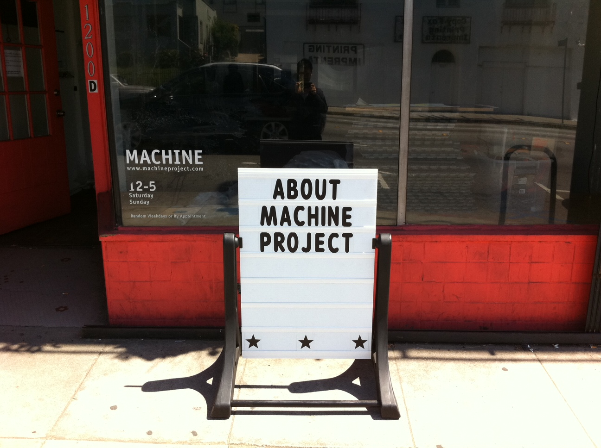
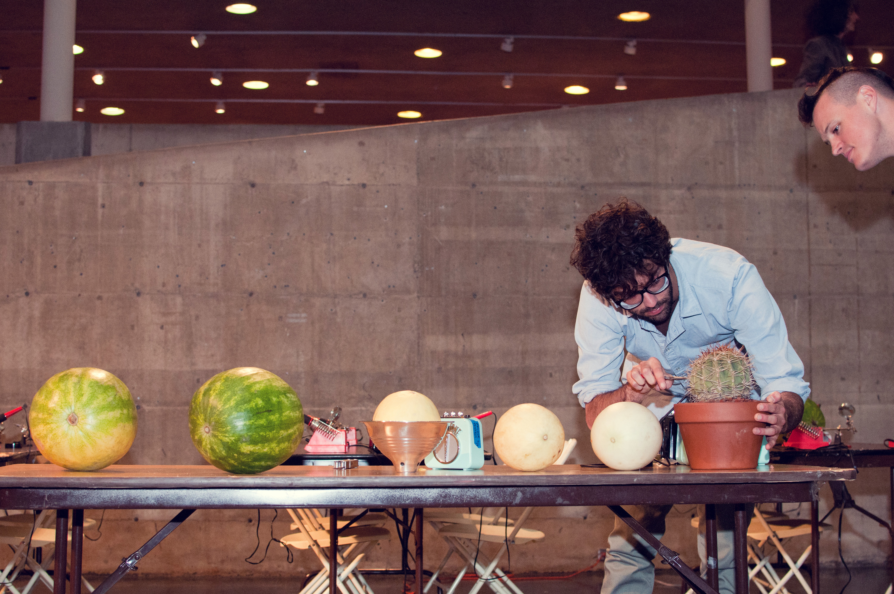
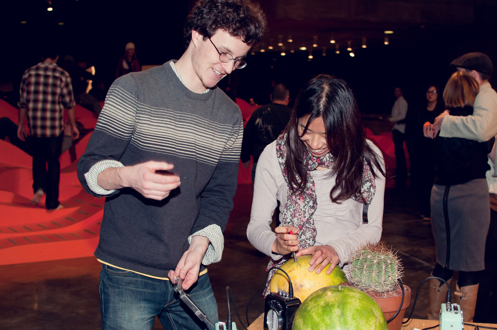
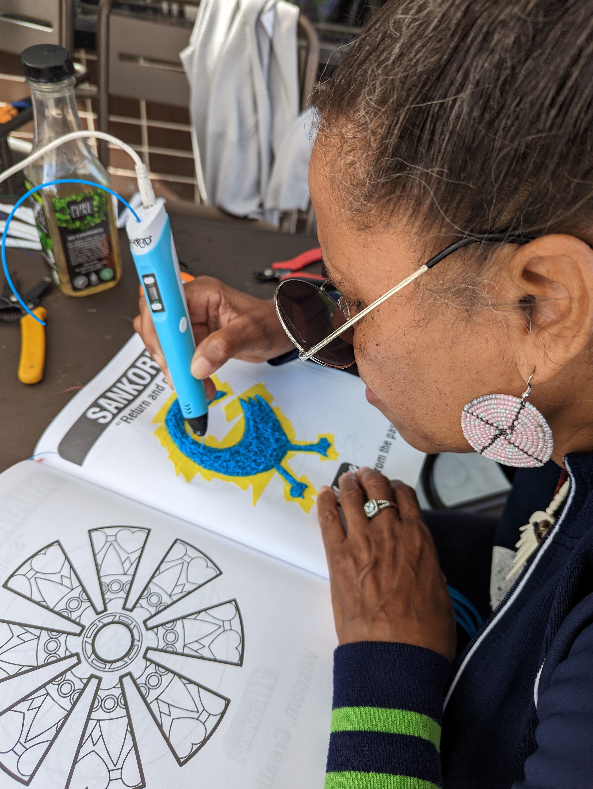
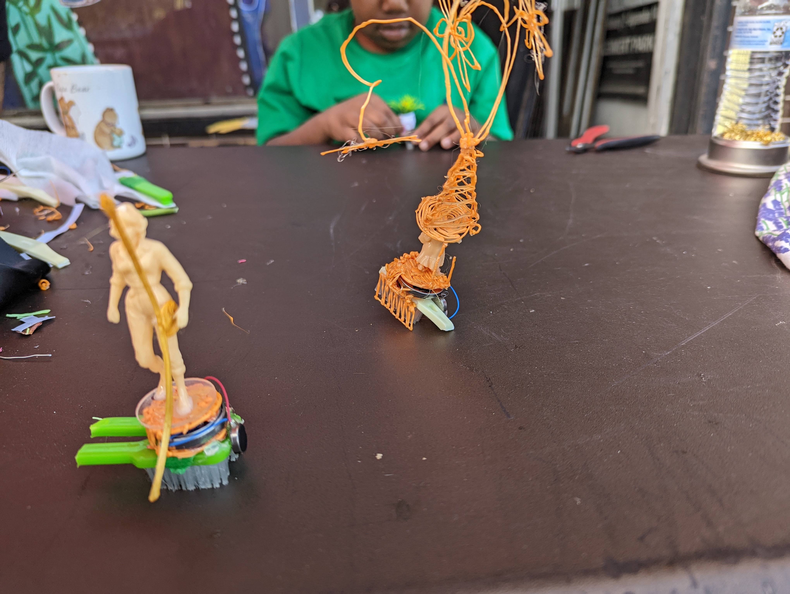

# Physical Computing for Interaction
#### Casey Anderson, 2024

##### Session 1.1

---

<!-- paginate: true -->

## Session 1.1

- **Lecture** Design for Community Education
- **Lecture/Workshop** Introduction to Ideation Strategies (10/5/1 ideas, Prototype Proposal)

---

## Design for Community Education

Sites
* [Machine Project](https://machineproject.com/): Echo Park, Los Angeles, CA
* [Lek&ograve;l Kominote Mat&egrave;nwa](https://www.matenwa.org/): Mat&egrave;nwa, La Gon&acirc;ve, Haiti
* KAOS Network: Leimert Park, Los Angeles, CA

---

## Machine Project

Machine Project was a community art space founded by [Mark Allen](https://www.markallen.com/) and active in Los Angeles  from 2003-2018. I used to live around the corner from the space and taught workshops / collaborated on events there extensively.

---

### About Machine Project

"Machine Project is an informal, non-profit, educational institution located in a storefront space in the Echo Park neighborhood of Los Angeles and a group of people working together to create, study and share new forms of culture and ways of living. We collaborate with artists, thinkers and local communities to produce non-commercial projects that investigate art, performance, technology, science, music, literature and new ideas for creative engagement. We believe an organization can be a machine for thinking together." (from [Machine Project's FAQ](https://machineproject.com/faq/))

---

### Electric Melon / Cactus

---

### Electric Melon / Cactus

My earliest workshops for Machine Project focused on teaching folks to build [Piezoelectric](https://en.wikipedia.org/wiki/Piezoelectricity) microphones (i.e. "contact microphones").

Contact microphones amplify vibrations in an object or on a surface.

---

### Electric Melon / Cactus

The material properties of the object, as well as its size, dictate the resulting (frequently percussive) sounds. Large, hollow objects (a metal container) sound different than thin, brittle objects (a piece of paper) through a contact microphone.

The first version of this workshop was an *Amplified Party* (with [John P. Hastings](https://www.johnphastings.org/)). We taught participants to build the mics and then attached them to objects used during the party: cups for drinks, bowls for snacks, and chairs / tables became percussion instruments participants played by behaving normally at a party.

---

### Electric Melon / Cactus

Following *Amplified Party* I began collaborating on the development of *Electric Melon / Cactus*. This workshop included instruction regarding the creation of a contact microphone followed by assistance in amplifying a melon / cactus, which participants were encouraged to play like an instrument (or, in the case of the melon, eat while amplified).

---

### Electric Melon / Cactus

This workshop was programmed at the following venues in addition to Machine's regular space in Los Angeles: Houston Fine Arts Fair, Berkeley Art Museum, Armory Center for the Arts, and [LACMA](https://vimeo.com/16639969).

---

## LekI&ograve;l Kominote Mat&egrave;nwa

"Lekòl Kominote Matènwa (often abbreviated as LKM) is a community school in rural Haiti on the island of La Gonâve. LKM’s pedagogical philosophy emphasizes education in collaboration with, and celebration of, local knowledge and traditions. Classes are hands-on, often take place in the school’s gardens or chicken coop, and are lead by local residents of the island. LKM’s unique approach to education allows people 'to recognize that knowledge, confidence, and self-determination can be found in their own experiences and histories.'" (from *Repurpose, Remix, Bend: Piloting A Locally Defined Technology Curriculum*, Anderson)

---

### Laboratwa El&egrave;ktwonik Mat&egrave;nwa

I traveled to LKM with my collaborator, [Elizabeth Chin](https://elizabethjchin.com/), July of 2016 and 2019.

"...Over the course of two weeks, we lead training sessions for LKM’s faculty as well as workshops for children. In both cases, our activities at the school functioned as a means to explore what kind of hands-on technology curriculum is possible at LKM while simultaneously navigating the complexities of doing so sustainably in rural Haiti." (from *Repurpose, Remix, Bend: Piloting A Locally Defined Technology Curriculum*, Anderson)

---

### Paperclip Sculptures

---

### Paperclip Sculptures

"Following a quick soldering demonstration, participants were asked to build a sculpture using only paperclips, solder, and a soldering iron. Working to complete one’s sculpture requires sustained practice soldering, resulting in the rapid acquisition of this new technique. A large degree of creative interpretation was on display, as the word 'sculpture' took on a variety of meanings from participant to participant: name tag, bracelet, or geometric design, to name only a few." (from *Repurpose, Remix, Bend: Piloting A Locally Defined Technology Curriculum*, Anderson)

---

### Toothbrush Robots

During our Summer 2019 trip we began piloting the toothbrush robot workshop, where participants mount a simple circuit (a coin-cell battery and vibration motor) to a toothbrush with glue. The vibrating motor causes the bristles to move, similar to how an insect walks.

---

### Toothbrush Robots

The distribution of the battery, motor, and other decorative materials (cardboard, bottle caps, etc.) allows for a creative opportunity as well as structural reinforcement. Here we have a toothbrush robot airplane.

---

### CMOS Synthesizer

Our most technologically advanced workshop at LKM involved the creation of a light-sensitive synthesizer.

---

### CMOS Synthesizer

Participants experimented with sound design by comparing different resistor and capacitor pairings. Waving one's hands above, or shining a phone's flash light on, the light dependent resistors augmented each synthesizer's sounds.

---

### Curricular Persistence

Our workshops inspired a lot of independent experiments with technology, ranging from repairing broken household items (here multiple faculty work collaboratively to fix a room-sized LED light)...

---

### Curricular Persistence

...to designing decorative cooling systems for classrooms...

---

### Curricular Persistence

...as well as modeling a dream house with solder and painted sheets of aluminum (salvaged from old tin cans commonly available on La Gonâve).

These independent explorations indicate the likely success of a regular technology curriculum at LKM.

---

## KAOS Network

---

### KAOS Network

Elizabeth and I had been looking for a local (Los Angeles) site to continue developing our hands-on technology curriculum, due to our inability to return to Haiti since 2019. We also hoped to test what had been successful at LKM in other communities. We connected with Los Angeles-based filmmaker / community organizer Ben Caldwell, who invited us to teach on the sidewalk in front of his Leimert Park community arts center once a week. We have been doing so for two years.

---

### About KAOS Network

Ben founded KAOS Network in 1984. He often describes the initial inspiration as follows: "Most neighborhoods have a community lawyer, a community doctor. I wanted to explore what a 'community artist' could do for a specific neighborhood."

Ben's work with KAOS Network, over almost the last 40 years, has had a monumental, transformative impact on the Leimert Park community. He has spear-headed community projects (Leimert Park Art Walk, People's Street), hosted important performance events (Project Blowed, Bananas), and tirelessly advocated for his community.

---

### Toothbrush Robots

One day a week Elizabeth and I set up two tables full of electronics supplies under a portable tent in front of KAOS Network. Our toothbrush robot activity has become the defining feature of our work in Leimert. When passers-by make eye contact with us we invite them to join us by asking "Want to build a robot?"

---

### 3D Printing & African Masks

One of our collaborators, An Pan (a graduate of the program Elizabeth and I teach in at ArtCenter College of Design), introduced a number of popular activities requiring the use of a 3D Pen, or a 3D Printer in a handheld form factor.

---

### 3D Printing & Adinkra Symbols

Experiments with the 3D Pen lead to new activities that community members helped pilot. A coloring book of Adinkra (West African) symbols has become a popular repository of templates for 3D Pen exploration.

---

### Toothbrush Robots + 3D Pen

Participants often combine multiple activities into a new kind of hybrid activity. For example, children often decorate their toothbrush robots with the 3D Pen. We see such participant driven creation as a key sign of success of our work.

---

### KAOS Network & Sustainable Community Engagement

Community members often approach Elizabeth and I reticent to participate, believing that they are incapable of understanding technology. After being guided through building a robot, however, participants reveal that they have additional, more complex technology ideas they want to discuss. Community members leave a session with us feeling energized to participate in the development of community-facing, technology-mediated projects in the neighborhood, many of which are spear-headed by Ben and KAOS Network.

---

## Introduction to Ideation Strategies: 10/5/1 Ideas

1. Qickly generate an illustrated list/collection of ten (10) ideas.

2. Revise your list so that only five (5) revisions remain. Do not think too hard about this.

3. Make a new version of your illustrated list / collection, this time of your remaining five (5) ideas

4. Pick one (1) of those remaining five (5) ideas to actually pursue / make

---

## Introduction to Ideation Strategies: Prototype Proposal (1/3)

- Title: giving your prototype a title sometimes helps you prioritize focusing on certain things over others
- Inspiration / Background: where did your idea come from? What lead you to this particular idea? What about this is interesting to you (specifically) and why?

---

## Introduction to Ideation Strategies: Prototype Proposal (2/3)

- Summary of the Experience: what is it? Is it a tool? An experience? What kind of an experience?
- Invitation How do you invite someone to use your prototype with a one sentence statement?
---

## Introduction to Ideation Strategies: Prototype Proposal (3/3)

- Materials: what do you need to make this prototype? List the materials here
- Supporting Media: in the early stages this can be sketches or simple images, but our goal is to have a short video of your working prototype
