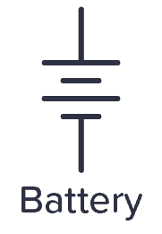
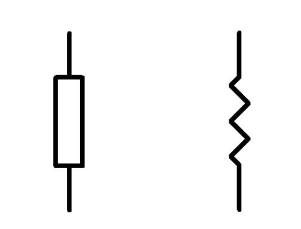
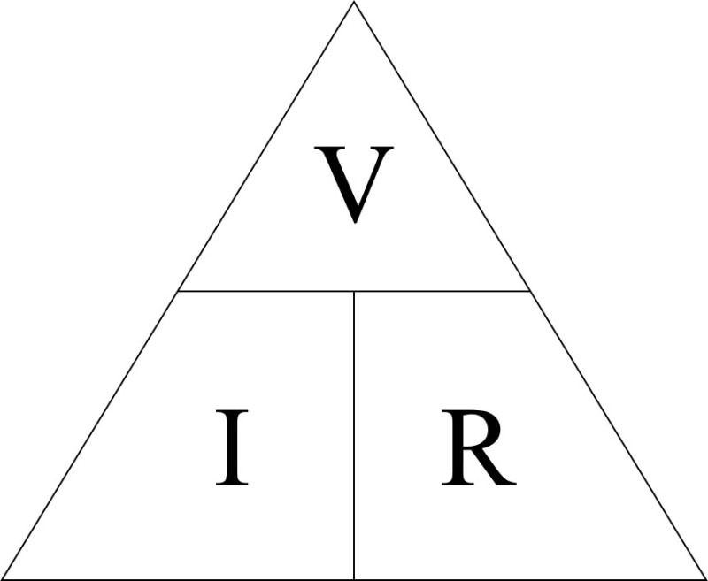
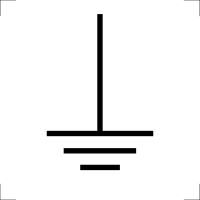
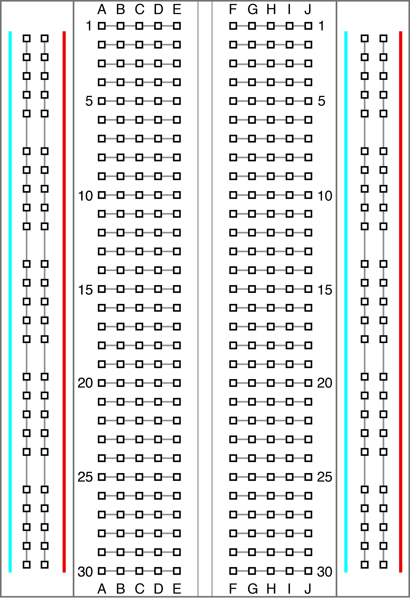
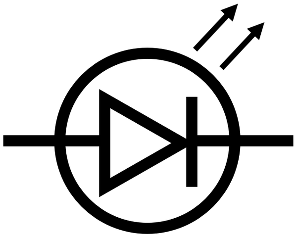
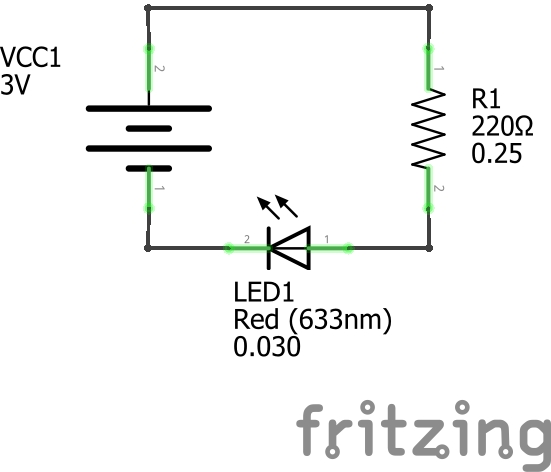

# Physical Computing for Interaction
#### Casey Anderson, 2024

##### Session 1.2

photo here!

---

<!-- paginate: true -->

## Session 1.2

- **Workshop** Introduction to Electronics
- **Workshop** Prototyping on a Breadboard
- **Workshop** LED Circuits
- **Assignment** 10/5/1 Sketches; Prototype Proposal

---

## Introduction to Electronics: Required Materials (1/2)

- Laptop (Mac or PC)
- Arduino Uno (R4 or similar)
- USB Micro-B
- Half-size breadboard
- Breadboarding wire bundle
- Breadboard trim potentiometer - 10K
- Photo cell

---

## Introduction to Electronics: Required Materials (2/2)

- Tactile Switch Buttons (12mm square, 6mm tall) x 10 pack
- Through-Hole Resistors - 220 ohm 10% 1/4W, 10K ohm 5% 1/4W - Pack of 25 each
- Super Bright Red 5mm LED (25 pack) or similar
- Copper Foil Tape with Conductive Adhesive, 1/4 In. Wide

---

## Introduction to Electronics

**Electricity** is the flow of **electrons**.

Working with electricity requires an understanding of the behavior of electrons. We can measure this behavior in order to decide how to accomplish certain goals.

For our purposes we will limit our electronics discussion to the following characteristics: **resistance**, **current**, and **voltage**.

---

### Voltage

**Voltage** is the **potential difference** in quantity of electrons between two points in a circuit. This difference results in an **electromotive force**.

The higher the voltage (measured in **volts**), the more **force** an electron experiences.

---

### Resistance

**Resistance** (measured in **Ohms**) is the measure of the opposition to electron flow in a circuit.

Frequently we need to limit current flow, for example: a resistor is used with an **LED** in order to avoid breaking the LED.

---

### Current

Electrical current is the rate of **electron flow**. When a **voltage** is applied across a **resistance** electrons will flow through a conductor (i.e. wire) at a specific speed. In other words, current describes the speed of electron travel.

We measure current in **amps** (the full term is **amperes**, actually, but I have literally never heard a single person say anything other than **amps** and I have an electronics textbook that explicitly says not to say "amperes").

---

### Ohm's Law

The relationship between **voltage**, **current**, and **resistance** is described by **Ohm's Law**: "the current through a conductor between two poins is directly proopotional to the voltage across those points" ([wikipedia](https://en.wikipedia.org/wiki/Ohm%27s_law)).

---

### Ground

Ground is an electrical reference point from which voltages are measured. Ground is kind of like the electrical equivalent of sea level when describing about elevation.

---

## Prototyping on a Breadboard

A breadboard allows one to prototype circuits without a soldering iron. It has a pattern of pre-established connections that are illustrated in the diagram to the left (from [here](https://ctools.ece.utah.edu/_Outreach/_Outreach.htm))

---

### Breadboard layout

On the left and right sides, running vertically, are **two power rails**. All points on the blue rail are connected, all points on the red rail are also connected. The red and blue rails are **not** connected to each other. Typically we run **Power (V+)** to red and **GND (V-)** to blue.

---

### Breadboard layout

The inside of the breadboard is divided into two sides, separated by a space. Each point in row 1 is labeled via letters A - E. Points 1A - 1E are connected. On the other side of the space row 1 continues: Points 1F - 1J are connected. Points 1A - 1E and 1F - 1J are not connected.

---

### LEDs

Diodes are components that allow unidirectional current flow. A common type of diode is a Light Emitting Diode (LED).

LED polarity is indicated by the length of its legs: the long leg (**anode**) is positive, the short leg (**cathode**) is negative.

---

### LED Circuit

---

## Assignment：10/5/1 Sketches; Prototype Proposal

### 10/5/1 Ideas (Format)

* Quickly generate an illustrated list/collection of ten (10) ideas.
* Revise your list so that only five (5) revisions remain.
* Make a new version of your illustrated list / collection, this time of your remaining five (5) ideas
* Pick one (1) of those remaining five (5) ideas to actually pursue / make

---

### 10/5/1 Ideas Assignment

Complete the 10/5/1 Ideas exercise described in the previous slide with the goal of identifying a unique way of changing the appearance of a lit LED (ex: wrapping it in a semi-transparent, colorful piece of material to change the color). Be ready to share your ideas with your colleagues.

---

### Prototype Proposal (Format)

* Title
* Inspiration / Background: where did your idea come from? What lead you to this particular idea?
* Summary of the Experience: what is it? what do people do?

---

### Prototype Proposal (Format)

* Invitation How do you invite someone to use your prototype with a one sentence statement?
* Materials: what do you need to make this prototype? List the materials here
* Supporting Media: in the early stages this may be sketches or simple images, but our goal is to have a short video of your working prototype

---

### Prototype Proposal (Assignment)

Find a sample interaction project that can be used to fill out the Prototype Proposal document.