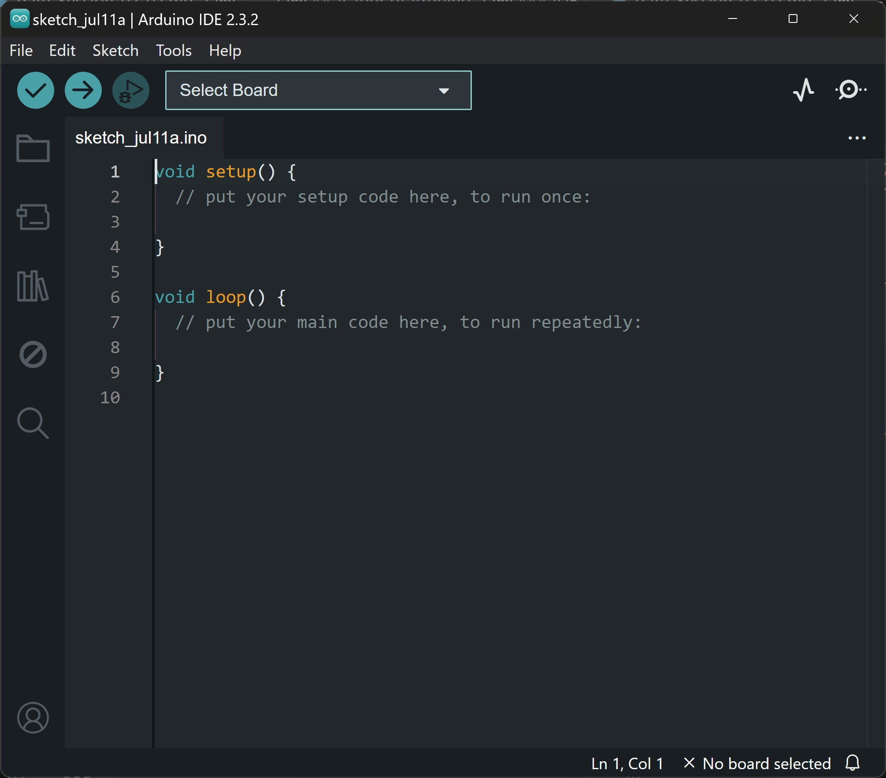
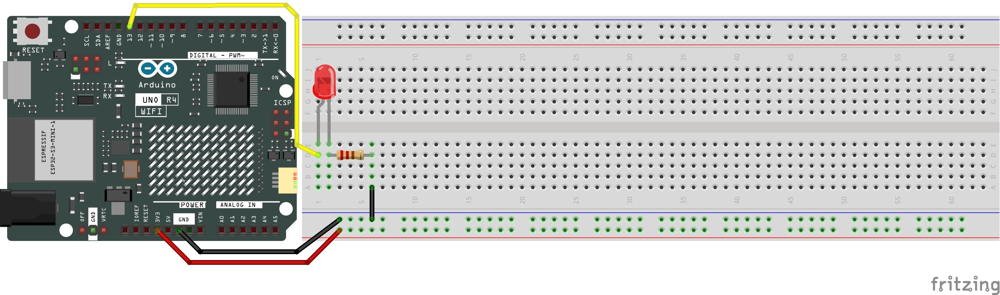
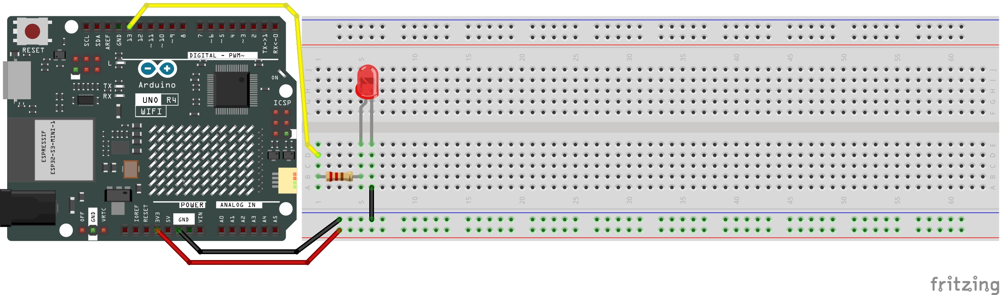
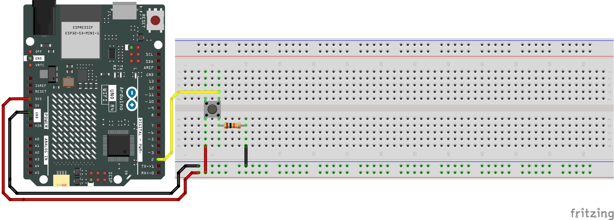

# Physical Computing for Interaction
#### Casey Anderson, 2024

##### Session 2.2

photo here!

---

<!-- paginate: true -->

## Session 2.2

- **Lecture / Workshop** A Tour of Arduino
- **Workshop** Blink
- **Workshop** Digital Input
- **Assignment** More Light Switch Circuits; Review Blink and Digital Input

---

## A Tour of Arduino
### IDE

* `{}`: denotes a function
* `void setup()`: a function that runs first and once
* `void loop()`: a function that runs after `void setup()` forever

---

## Blink
### Internal LED

* `pinMode()`: declares a particular pin number an `INPUT` or `OUTPUT`
* `delay()`: halt progression of the program, a brute-force way to add a pause our code
* `digitalWrite()`: outputs a digital signal (`HIGH` or `LOW`) to an onboard LED

---

### Blink: Internal LED

Experiment by changing `delay()` times.

---

### Blink: External LED

Hookup pattern (1)

---

### Blink: External LED

Hookup pattern (2)

---

## Digital Input
### Button (Internal LED)

Hookup Pattern

---

### Button (Internal LED)

* `const int`: `buttonPin` is of type `int` and will not change
* `Serial.begin(9600)`: initializes Serial communication
* `digitalRead(buttonPin)` read / store state of pushbutton
* What does the `if` statement do currently?

---

### Button (External LED)

Hookup Pattern

---

### Button (External LED)

* `digitalWrite`: set `ledPin` `HIGH` or `LOW`

---

## Assignments
### More Light Switch Circuits

Be prepared to wire up working versions of the following LED Circuits:

1) 1x Switch 1x LED
3) 2x Switches 2x LEDs

---

## Assignments
### Review: Blink, Button examples

Be prepared to quickly wire up any of the Arduino examples we covered today.