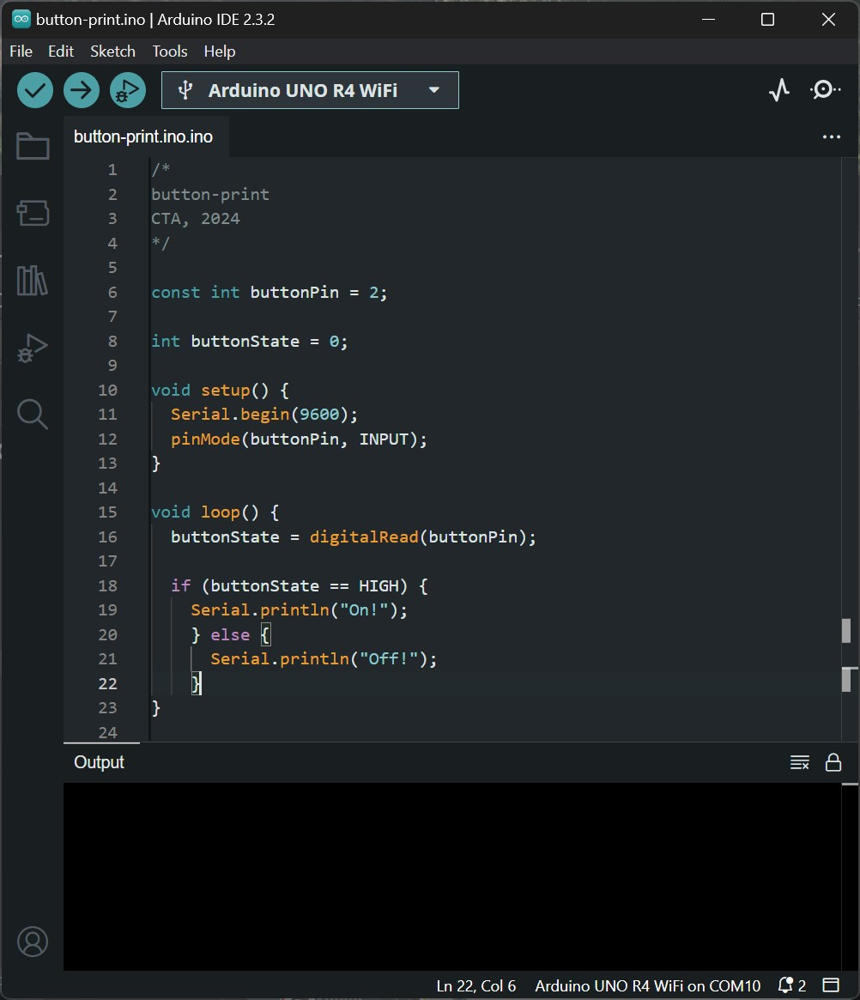

# Physical Computing for Interaction
#### Casey Anderson, 2024

##### Session 4.2

photo here!

---

<!-- paginate: true -->

## Session 4.2

- **Workshop** Counting Button Presses
- **Lecture** Introduction to Analog Sesnsors / Voltage Dividers
- **Assignment**

---

## Counting Button Presses

Hookup Pattern

---
### Counting Button Presses

Let's quickly review our simplest model for using a button press to change the state of an `LED`.

Here we turn the LED on if the button is pressed. Do you think this structure can be used to count presses?

---

### Counting Button Presses

Here we block repeat triggers by checking for a `State Change` rather than simply whether or not 