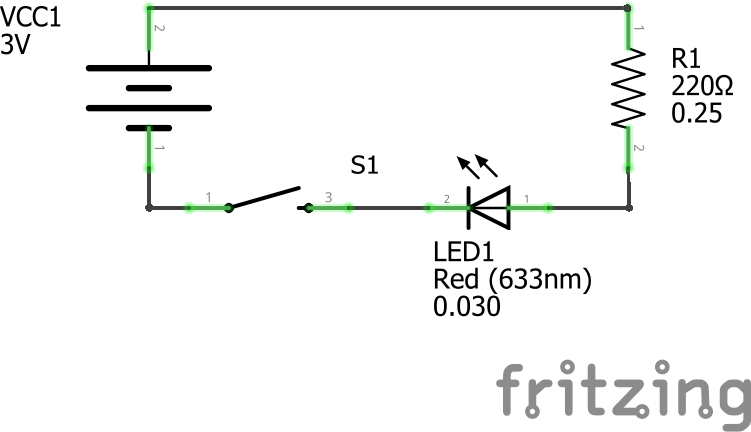
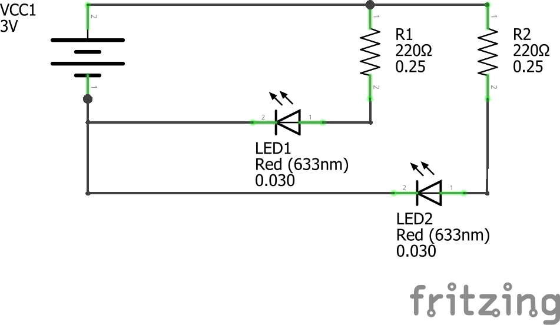

# Physical Computing for Interaction
#### Casey Anderson, 2024

##### Session 2.1

photo here!

---

<!-- paginate: true -->

## Session 2.1

- Review Assignments
- **Workshop** Light Switch Circuit (1x1)
- **Workshop** Multiple Light Switch Circuit (2x2)

---

## LED Switch Circuit

---

### 2x LED Circuit

