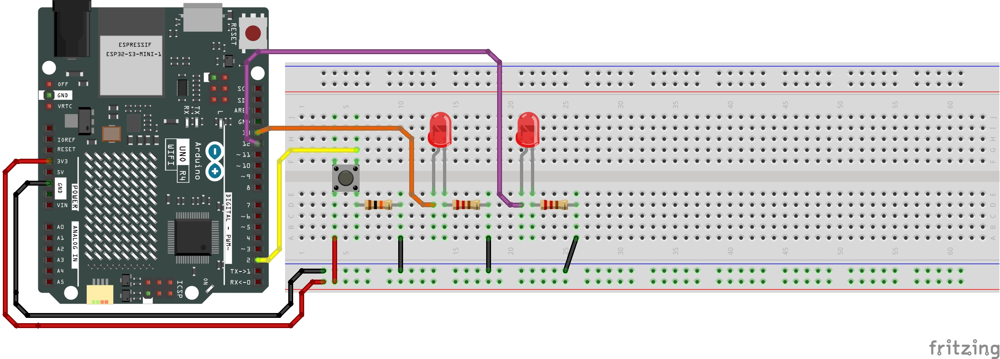
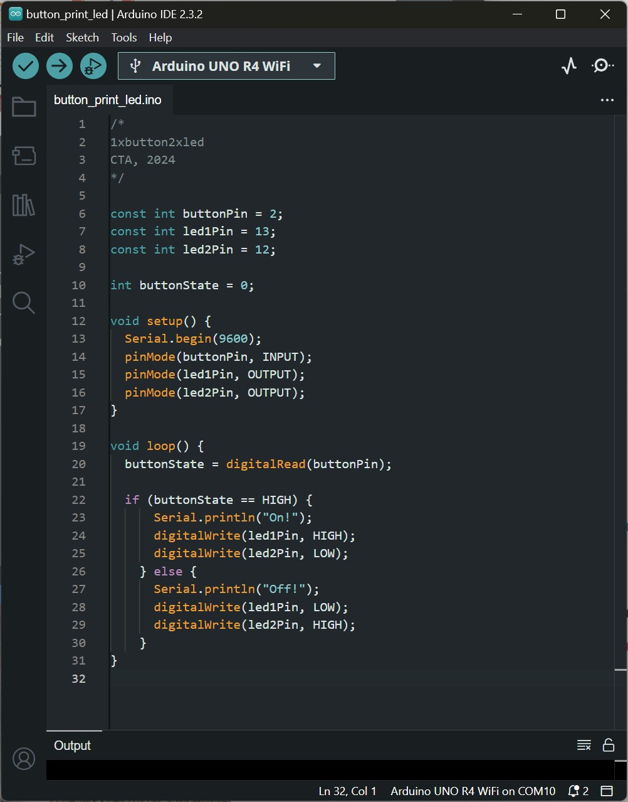

# Physical Computing for Interaction
#### Casey Anderson, 2024

##### Session 4.1

photo here!

---

<!-- paginate: true -->

## Session 4.1

- Demo and Review 2x DIY Button Prototypes
- **Workshop** 1x Button 2x LEDs

---

### 1x Button 2x LEDs

Hookup Pattern

---

Compare this example to our previous 1x button 1x external LED example, get into groups of two and identify the differences