# Physical Computing for Interaction
#### Casey Anderson, 2024

##### Session 4.2

photo here!

---

<!-- paginate: true -->

## Session 4.2

- **Workshop** Counting Button Presses
- **Lecture** Introduction to Analog Sesnsors / Voltage Dividers
- **Assignment**

---

## Counting Button Presses

Hookup Pattern

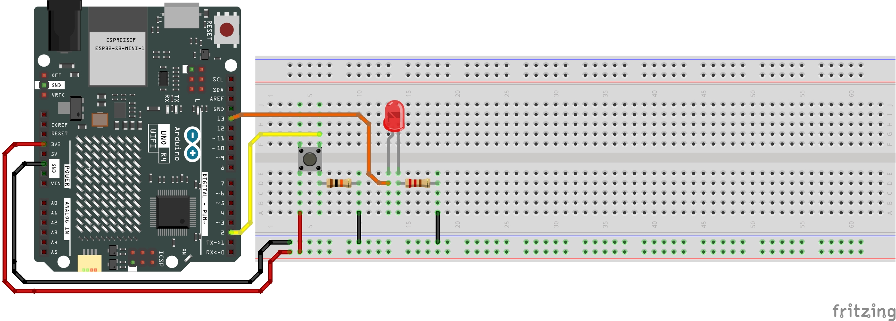

---
### Counting Button Presses

Let's quickly review our simplest model for using a button press to change the state of an `LED`.

Here we turn the LED on if the button is pressed. Do you think this structure can be used to count presses?

---

### Counting Button Presses

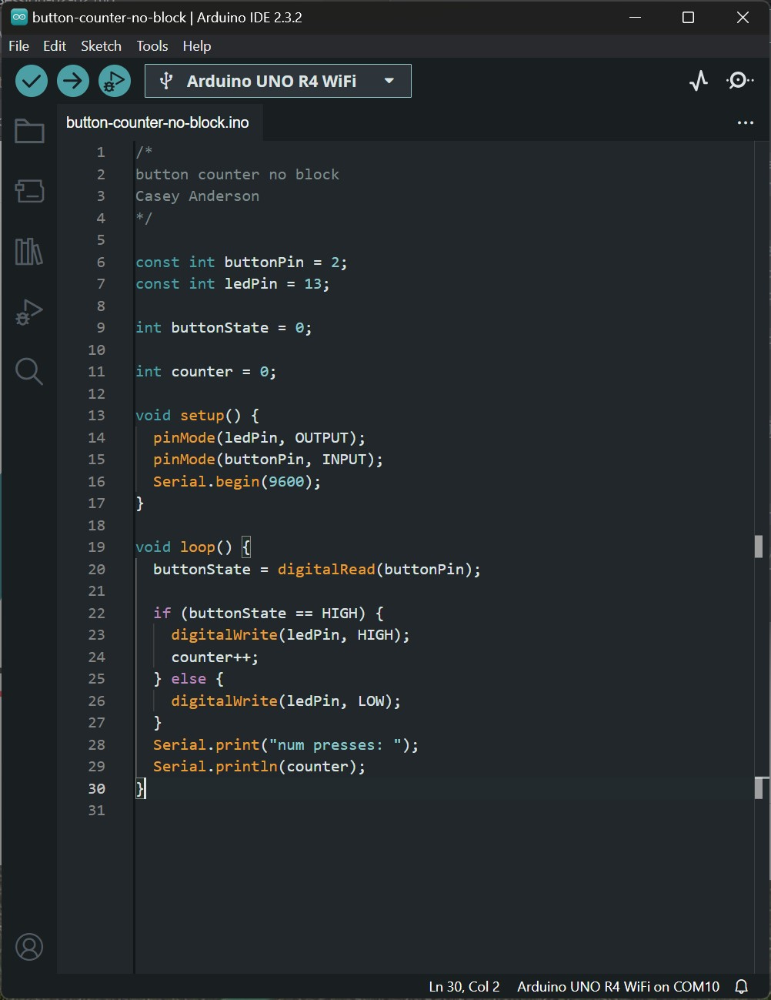

Here is one way to try to count button presses using the previous model. Do you see any issues with this? Is it possible to reliably count button presses this way?

---

### Counting Button Presses

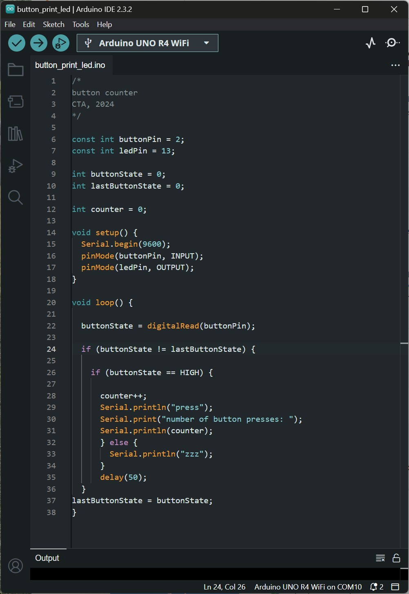

Here we use a totally different approach to count button presses: counting, instead, the change in State (going from `LOW` to `HIGH`), eliminating the repeat triggers.

---

### Counting Button Presses

How else could we make use of this structure? Get into groups of two and mock up a 1x button (input) 5x LED (output) prototype that makes use of a modified version of this code. We will compare our results at the end of the hour.

---

## Analog Sesnors / Voltage Dividers
### Electrical Signals

In electronics a signal is a time-varying quantity which conveys information. The quantity that is varying over time is typically voltage or current. Physical Computing involves interfacing two types of electrical signals: digital and analog.

---

### Digital Signals

A digital signal is comprised of a sequence of discrete values. We typically think of these values as binary, or sequences of 1 and 0, and associate them with computers.

---

### Digital Signals

To date we have exclusively worked with digital inputs and outputs: a button (input) is either connected (on) or disconnected (off); an LED (output) is either illuminated (on) or dark (off).

---

### Analog Signals
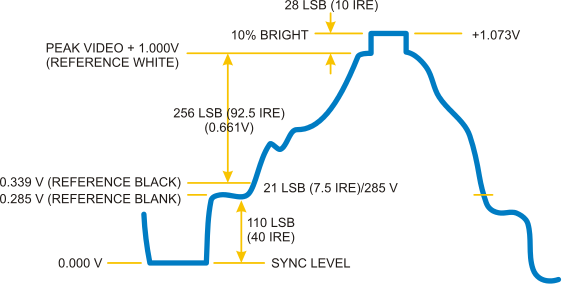

An analog signal is a signal varying value at any point within a given range. Generally people refer to phenomena in the "real world" as analog: light level, temperature, weight, etc.

Analog Capable Arduino pins begin with the letter `A`.

---

### Potentiometer

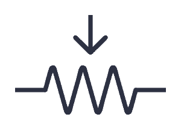

A potentiometer, sometimes called a knob or variable resistor, is a three pin component. Its resistance is dictated by the position of the knob between its minimum and maximum values.

---
### Potentiometer

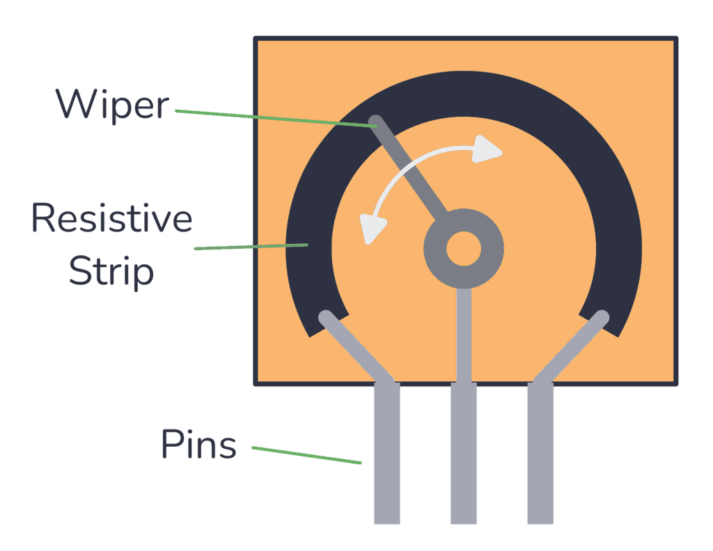

One can imagine the three pins as facial features: two ears (pins 1 and 3) and a nose (pin 2). The sensor value, or position of the knob with respect to its full rotation, can be found on pin 2. Pins 1 and 3 need to be connected to `Voltage` and `Ground` respectively.

---
### Potentiometer

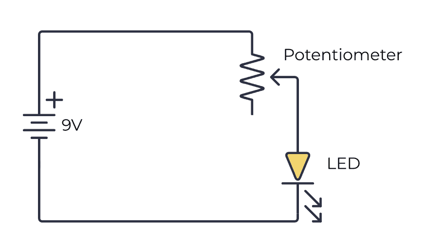

Get into groups of two and wire up this example, using your Arduino's `3.3V` and `Gnd` pins to act as a battery

---

### analog read

Hookup Pattern

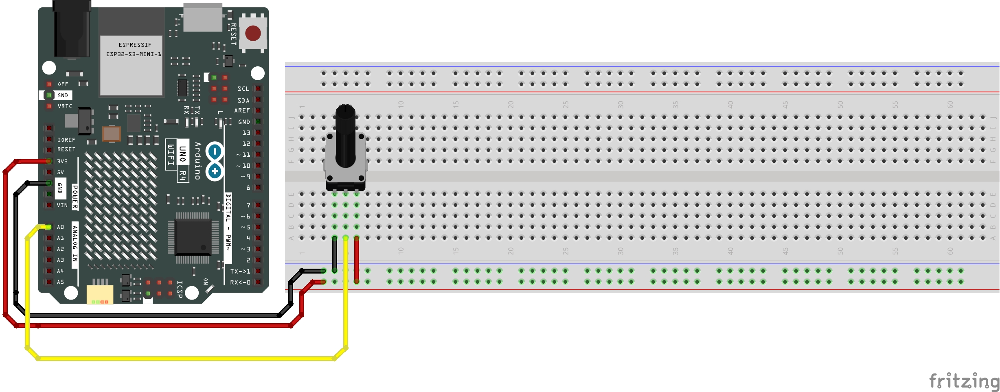

Wire up a potentiometer to `A0` on your Arduino as shown here.

---

### analog read

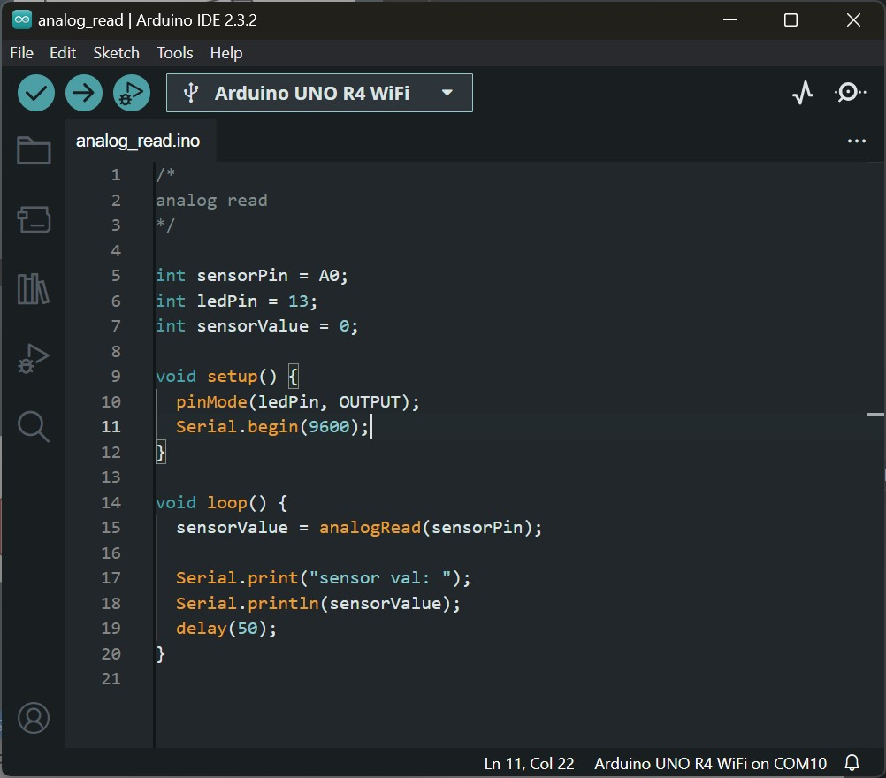

In groups, take some time to investigate the following:
* what is the lowest number you can get out of your potentiometer?
* what is the highest number?
* what happens if you move your potentiometer knob and let it stay in one position?

---

### Voltage Dividers

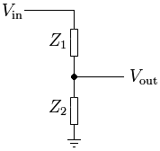

A voltage divider is a circuit that produces an output that is smaller than its input (where the output is voltage or current).

---

### Light Dependent Resistor

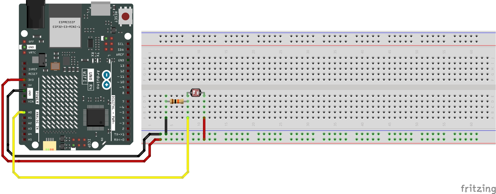

Wire up a light sensor as shown to the right and try running the analog read example again. How does this compare to the potentiometer?

---

### Light Dependent Resistor

In groups, take some time to investigate the following:
* what is the lowest number you can get out of your light sensor?
* what is the highest number?
* what happens if you simply leave your light sensor alone?

---

## Assignments

* 2x Input 2x Output Prototype v1
* Draft Prototype Proposal v1
* 10/5/1 Ideas doc v1