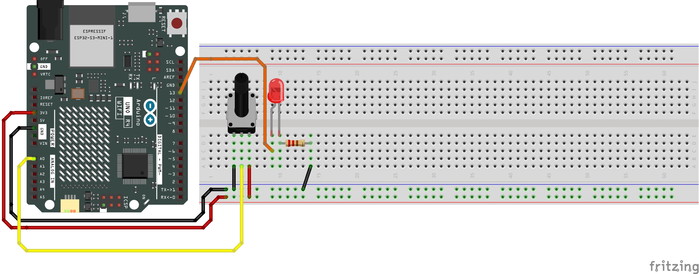
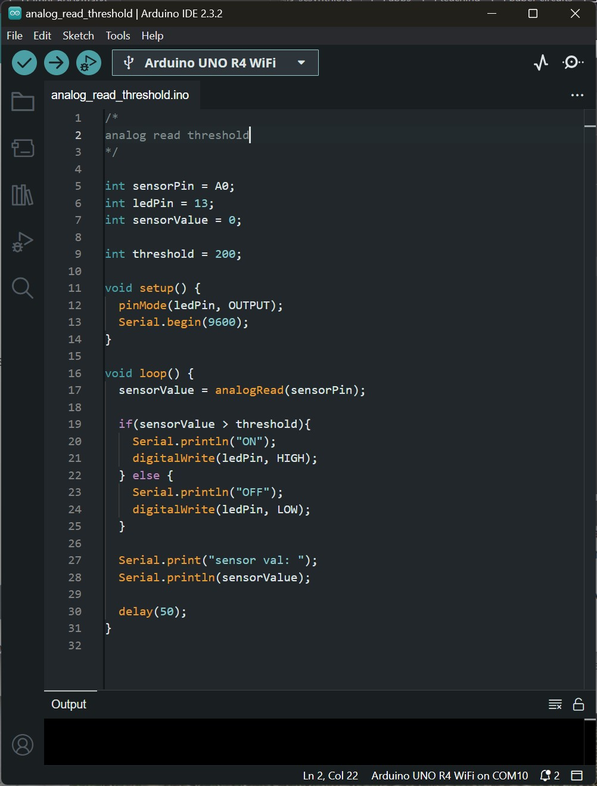
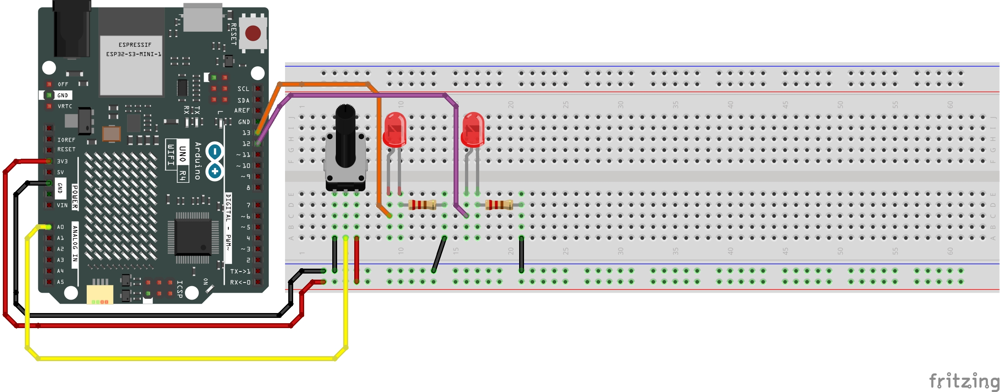
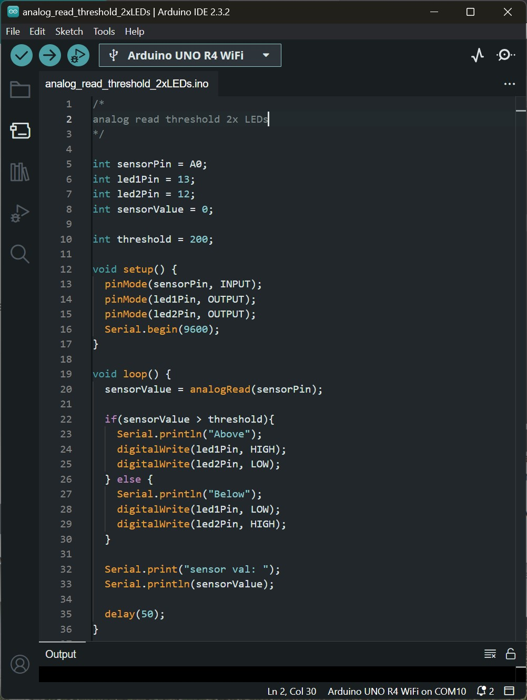

# Physical Computing for Interaction
#### Casey Anderson, 2024

##### Session 5.1

photo here!

---

<!-- paginate: true -->

## Session 5.1

- **Critique** Review Prototypes, User Testing
- **Workshop** Analog Sensor Threshold

---
## Analog Sensor Threshold
Hookup Pattern

---

## Analog Sensor Threshold
### 1x LED

Here we use an `if` statement to see if our analog sensor has crossed a particular value (`threshold`). `if` we have exceeded 200 the `LED` turns on, otherwise it turns off.

---

### Analog Sensor Threshold (2x LEDs)

Hookup Pattern

Add a second `LED` as shown here.

---

### Analog Sensor Threshold (2x LEDs)

Here we repurpose our 1x Button 2x LED example from earlier such that exceeding a certain threshold switches which of the two `LEDs` is illuminated.

---

### Group Lab: 1x Potentiometer 4x LEDs

Get into groups and prototype a circuit where moving a potentiometer turns on one of 4 possible LEDs. Hint: you will need to make use of `else if`