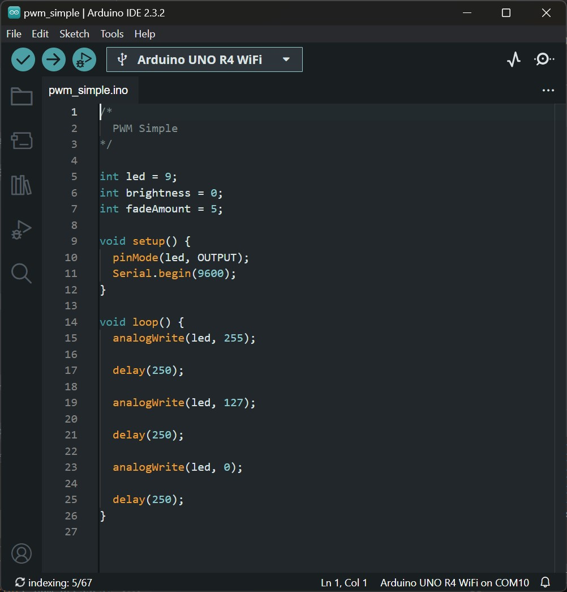

# Physical Computing for Interaction
#### Casey Anderson, 2024

##### Session 5.2

photo here!

---

<!-- paginate: true -->

## Session 5.2

- **Workshop** Controlling LED Brightness
- **Assignment** 2x Input 2x Output Prototype v2; Draft Prototype Proposal v2; 10/5/1 Revisions

---

## Controlling LED Brightness
### for loops

for loops allow one to iterate (repeat) over a collection or sequence. Abstractly all for loops share this structure:

```
for (initialization; condition; increment) {
  // actions to perform
}
```

---
### for loops

Get into groups and wire up an `LED` and `Resistor` on the following pins: 3,5,6,9


---

### ADC, DAC, and PWM
#### Analog to Digital Conversion (ADC)

`Analog to Digital Conversion` (`ADC`) is the process of converting a varying voltage (analog) to a sequence of discrete voltages (digital). Arduino provides a convenient interface for this via `analogRead()`, which can be used on any pin whose number is prepended with an A.

---

#### Digital to Analog Conversion (DAC)


`Digital to Analog Conversion` (`DAC`) is the opposite of `ADC`: a `DAC` converts a sequence of discrete voltages into a varying voltage. In order to approximate an analog voltage with a digital pin on the Arduino one typically uses `Pulse Width Modulation` (`PWM`).

---


This is accomplished by toggling a digital pin on and off very quickly.

The image to the right is an example of PWM output. Note that it approximates an analog voltage but, if we look closely, we can still observe the discrete steps of the original digital signal.

---



Here we cycle through 3 different brightness: approximately 100%, 50%, and 0%.

---

## Assignment

* 2x Input 2x Output Prototype v2
* Draft Prototype Proposal v2
* 10/5/1 Ideas doc v2