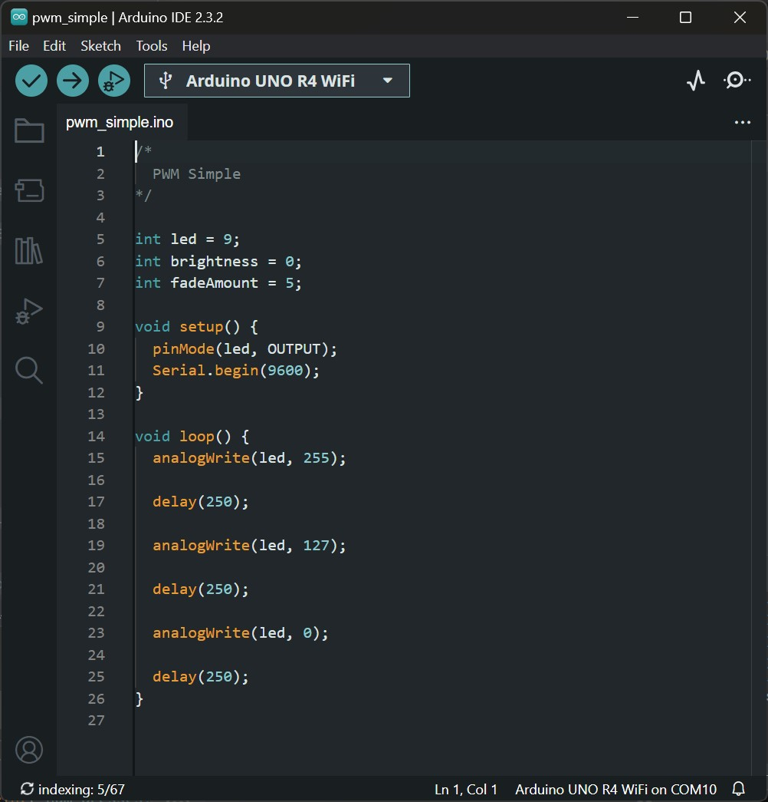

# Physical Computing for Interaction
#### Casey Anderson, 2024

##### Session 6.1

photo here!

---

<!-- paginate: true -->

## Session 6.1

- **Critique** Review Prototypes, User Testing
- **Workshop** LED Animation

---

## LED Animation

Hookup Pattern

---

### LED Animation (Fade Lab)

Get into groups of two and study this code. Take the next half an hour to produce some alternate versions of this:
* led brightness fades in from 0% to 100% brightness and then blinks rhythmically three times
* led brightness fades out from 100% to 0% brightness, cued by a button press